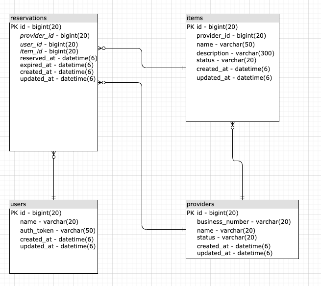

# 대리 예약 시스템 (Reservation Delegator)

## Requirement
- 예약 기능
	- 식당, 회의실, 스터디룸 등등을 아우를 수 있는 공통 예약 기능
	- 중복 요청 및 따닥 API 방지
	- 예약 가능한 자원(식당, 회의실, 스터디룸 등등 예약의 Target)들에 Lock을 거는 기능
		- redis를 이용한 lock 로직 구현
 	- 예약 결과 알림 기능 (kakao talk, email, slack 등등)
 		- kafka연동하여 예약 결과 알림 기능을 비동기로 처리
- 예약 관리 기능
	- 예약 정보 CRUD
	- 예약 정보 관리에 대한 Permission 관리
	- 예약 정보 관리자 페이지
- 대기열 
	- on/off 기능 
	- limit count 설정 (관리자 페이지에서 연동 시스템마다 다르게 설정이 가능하도록)
	- 대기 순위 view page
		- redis pub/sub 기능을 이용하여 현재 대기 순서 번호 제공
- OAuth2.0을 이용한 회원 관리
	- OAuth 연동
	- token 관리

## ERD

[reservation-delegator-erd](https://drive.google.com/file/d/1aZu8lS3BTOg9O9Dgrt80XoYtMKgHLe_T/view?usp=sharing)

